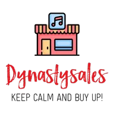

# DynastySales - E-commerce Full Stack

<p align="center">

</p>

## 🚀 Project Overview

DynastySales is a professional Full Stack e-commerce application. It features a robust **Backend** built with Node.js and Sequelize and a modern **Frontend** developed with React and Vite. The project implements key industry practices such as **Soft Deletes**, centralized state management, and secure authentication.

---

## 🛠️ Tech Stack

### Frontend

* **React + Vite**: Fast development and optimized build tool.
* **Zustand**: Lightweight and scalable state management.
* **React Query (TanStack)**: Efficient server-state synchronization and caching.
* **Ant Design**: Comprehensive UI component library for professional layouts.
* **Styled Components**: CSS-in-JS for modular and dynamic styling.
* **Axios**: Promise-based HTTP client for API requests.

### Backend

* **Node.js & Express**: Core server-side framework.
* **MySQL & Sequelize (ORM)**: Relational database management with advanced modeling.
* **Bcrypt**: Password hashing for secure user authentication.
* **Express Session**: Session-based authentication and security.
* **Express Validator**: Middleware for robust data validation.

---

## ⚙️ Installation & Setup

### 1. Database Configuration

* Ensure you have **MySQL** installed and running.
* Execute the SQL script located at `./backend/src/database/DynastySales_Database_Schema.sql` to create the database schema, tables, and seed initial data.

### 2. Backend Setup

1. Navigate to the backend directory: `cd backend`.
2. Install dependencies: `npm install`.
3. Create a `.env` file in the root of the `/backend` folder and add your credentials:
```env
DB_USER=your_mysql_user
DB_PASSWORD=your_mysql_password
DB_NAME=dynastysales_db
DB_HOST=127.0.0.1
SESSION_SECRET=your_secret_key

```


4. Start the server: `npm run dev`.

### 3. Frontend Setup

1. Navigate to the frontend directory: `cd frontend`.
2. Install dependencies: `npm install`.
3. Start the application: `npm run dev`.

---

## 🔑 Demo Credentials

To access the administrative features (Product Management, User Management, Soft Delete viewing), use the following default account:

* **Email:** `admin@dynastysales.com`
* **Password:** `admin123`

---

---

## 🚀 Resumen del Proyecto

DynastySales es una aplicación de comercio electrónico Full Stack profesional. Cuenta con un **Backend** sólido construido con Node.js y Sequelize y un **Frontend** moderno desarrollado con React y Vite. El proyecto implementa prácticas clave de la industria como **Borrado Lógico (Soft Deletes)**, gestión de estado centralizada y autenticación segura.

## 🛠️ Tecnologías Utilizadas

### Frontend

* **React + Vite**: Herramienta de desarrollo rápida y optimizada.
* **Zustand**: Gestión de estado ligera y escalable.
* **React Query**: Sincronización eficiente del estado del servidor.
* **Ant Design**: Biblioteca de componentes UI para diseños profesionales.
* **Styled Components**: Estilos modulares y dinámicos mediante CSS-in-JS.

### Backend

* **Node.js & Express**: Framework principal para el servidor.
* **MySQL & Sequelize (ORM)**: Gestión de base de datos relacional y modelado de datos.
* **Bcrypt**: Encriptación de contraseñas para seguridad.
* **Express Session**: Gestión de sesiones de usuario.
* **Express Validator**: Validación robusta de datos de entrada.

## ⚙️ Instalación y Configuración

### 1. Configuración de la Base de Datos

* Ejecute el script SQL ubicado en `./backend/src/database/DynastySales_Database_Schema.sql` para crear el esquema, las tablas y los datos iniciales.

### 2. Configuración del Backend

1. Ir a la carpeta: `cd backend`.
2. Instalar dependencias: `npm install`.
3. Configurar el archivo `.env` con las credenciales locales de MySQL.
4. Iniciar: `npm run dev`.

### 3. Configuración del Frontend

1. Ir a la carpeta: `cd frontend`.
2. Instalar dependencias: `npm install`.
3. Iniciar: `npm run dev`.

## 🔑 Credenciales de Prueba

Para probar las funciones de administrador:

* **Email:** `admin@dynastysales.com`
* **Password:** `admin123`